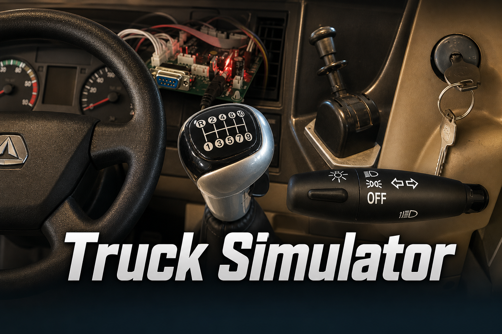

# Truck Simulator

Arduino firmware that emulates the serial protocol of a Chinese truck driving simulator cockpit. It generates realistic binary control frames over UART so you can develop, test, and reverse-engineer PC-side software without the full physical hardware.

> Related repository: [truck-sim-firmware](https://github.com/alex-bluetrain/truck-sim-firmware)

## Overview

The simulator sends a fixed **12-byte binary packet** at **19200 baud** containing pedal positions, steering angle, gear selection, and dashboard switch states (lights, turn signals, horn, seatbelt, etc.).

On boot, the firmware runs an automated demo sequence that cycles through:

- Gears 1–5 with neutral pauses
- Accelerator, brake, and clutch sweeps (sine-wave profiles)
- Full steering wheel rotation
- Hazard lights and individual switch toggling

A physical button can override the low-beam light state in real time.

## Features

- **12-byte packed protocol** matching the original simulator hardware
- **Automated demo loop** for end-to-end testing without user input
- **Real-time override** of low-beam lights via GPIO button
- **Bit-level inversion** for signals that use inverted logic on Chinese simulators (`1 = off`, `0 = on`)
- **Steering endianness swap** applied before transmission

## Hardware Requirements

| Component                | Notes                                                  |
| ------------------------ | ------------------------------------------------------ |
| Arduino-compatible board | Uno, Nano, or similar AVR board                        |
| USB cable                | For flashing and serial monitoring                     |
| Optional push button     | Connected to pin 5 for low-beam override               |
| Optional analog inputs   | Pins A0 and A1 reserved for future pedal/wheel sensors |

## Pin Mapping

| Pin  | Function                                      |
| ---- | --------------------------------------------- |
| `13` | Built-in LED (status)                         |
| `5`  | Button 1 — low-beam override (`INPUT_PULLUP`) |
| `6`  | Button 2 — reserved (`INPUT_PULLUP`)          |
| `A0` | Analog input — reserved                       |
| `A1` | Analog input — reserved                       |

## Serial Protocol

Each frame is exactly **12 bytes**. The structure is defined in `exo.h` as a packed C struct:

```
┌──────────┬─────────────────────────────────────────────────────────────┐
│ Offset   │ Field                                                       │
├──────────┼─────────────────────────────────────────────────────────────┤
│ 0        │ Header 1 — `0xAA`                                           │
│ 1        │ Header 2 — `0x10`                                           │
│ 2        │ Clutch (0–255)                                              │
│ 3        │ Accelerator (0–255)                                         │
│ 4        │ Brake (0–255)                                               │
│ 5–6      │ Steering wheel (int16, bytes swapped on transmit)           │
│ 7        │ Lights / signals (bitfield)                                 │
│ 8        │ High beam / wipers (bitfield)                               │
│ 9        │ Gears / handbrake / horn (bitfield)                         │
│ 10       │ High-range / heater (bitfield)                              │
│ 11       │ Checksum (`0xFF`) + Footer (`0xBB`)                         │
└──────────┴─────────────────────────────────────────────────────────────┘
```

### Byte 7 — Primary switches

| Bit | Field                                        |
| --- | -------------------------------------------- |
| 0   | Low beam (`luzbaja`)                         |
| 1   | Left turn signal (`giroizq`)                 |
| 2   | Right turn signal (`giroder`)                |
| 3   | Starter (`arranque`)                         |
| 4   | Ignition / contact (`contacto`)              |
| 5   | Horn (`bocina`)                              |
| 6   | Seatbelt (`cinturon`) — inverted on transmit |
| 7   | Padding                                      |

### Byte 8 — Secondary lights

| Bit | Field                  |
| --- | ---------------------- |
| 0   | High beam (`luzalta`)  |
| 1   | Wiper 1 (`parabrisa1`) |
| 2   | Wiper 2 (`parabrisa2`) |
| 3–7 | Padding                |

### Byte 9 — Gears and handbrake

| Bit | Field                            |
| --- | -------------------------------- |
| 0   | Gear 5                           |
| 1   | Horn 2                           |
| 2   | Handbrake — inverted on transmit |
| 3   | Gear 4                           |
| 4   | Gear 2                           |
| 5   | Reverse                          |
| 6   | Gear 1                           |
| 7   | Gear 3                           |

### Byte 10 — Range selector

| Bit    | Field                                   |
| ------ | --------------------------------------- |
| 5      | High-range gears — inverted on transmit |
| 6      | Heater                                  |
| others | Padding                                 |

### Transmission transforms

Before each frame is sent over serial, `sendStruct()` applies:

1. **Steering byte swap** — bytes 5 and 6 are swapped (little-endian → big-endian)
2. **Inverted bits** — seatbelt (byte 7, bit 6), handbrake (byte 9, bit 2), and high-range (byte 10, bit 5) are XOR-toggled
3. **Low-beam override** — `luzbaja` is replaced with the live state of `BUTTON1`

## Getting Started

### Prerequisites

- [Arduino IDE](https://www.arduino.cc/en/software) 1.8.x or 2.x
- AVR board support (included by default for Uno/Nano)

### Installation

1. Clone the repository:

   ```bash
   git clone https://github.com/alex-bluetrain/truck-sim-firmware.git
   cd truck-sim-firmware
   ```

2. Open `Truck_Simulator.ino` in the Arduino IDE.

3. Select your board (**Tools → Board → Arduino Uno** or equivalent).

4. Select the correct serial port (**Tools → Port**).

5. Click **Upload**.

### Monitoring output

Open the Serial Monitor or any terminal emulator at **19200 baud, 8N1, raw binary mode** to capture the 12-byte frames.

> **Note:** The Serial Monitor in text mode will show garbled output because the firmware sends raw binary, not ASCII. Use a hex viewer or a custom PC listener instead.

## Project Structure

```
Truck_Simulator/
├── Truck_Simulator.ino   # Main sketch — demo loop and serial transmission
├── exo.h               # Protocol struct definition (simdata_t)
```

## Demo Sequence

When powered on, the firmware executes the following loop indefinitely:

1. **Gear cycle** — selects gears 1 through 5, holding each for ~960 ms with a neutral pause between shifts
2. **Pedal sweeps** — accelerator, brake, and clutch follow sine curves through their calibrated ranges
3. **Steering sweep** — full 360° rotation, then returns to center
4. **Hazard lights** — activates both turn signals
5. **Switch walk** — toggles each dashboard bit individually with 300 ms delays

Default resting values (before demo motion):

| Axis        | Default |
| ----------- | ------- |
| Clutch      | 136     |
| Accelerator | 144     |
| Brake       | 120     |
| Steering    | 0       |

## Contributing

Pull requests are welcome. If you extend the firmware with real analog pedal or steering inputs, please document your wiring in a comment or issue.

## License

No license file is included yet. All rights reserved by the author until a license is added.
